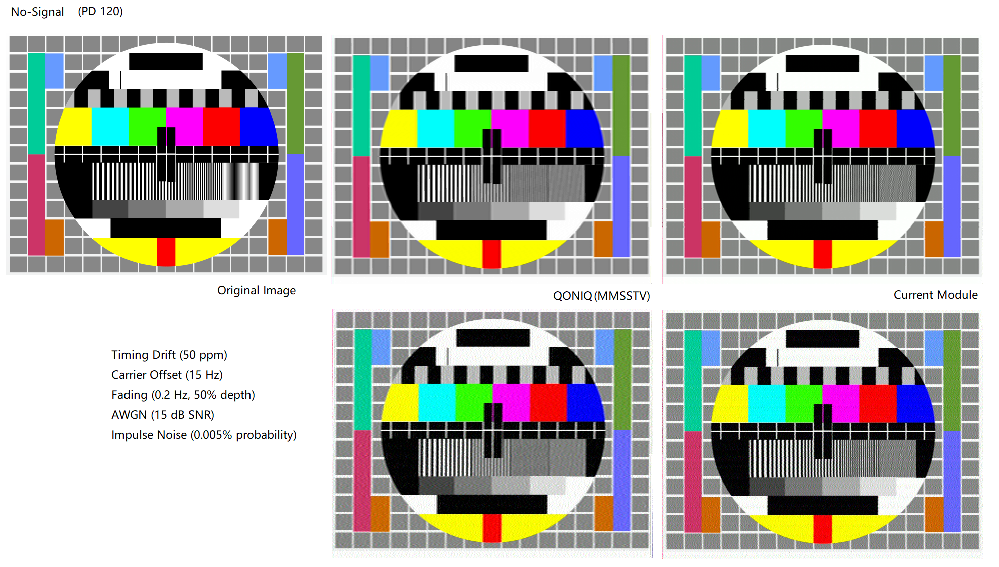
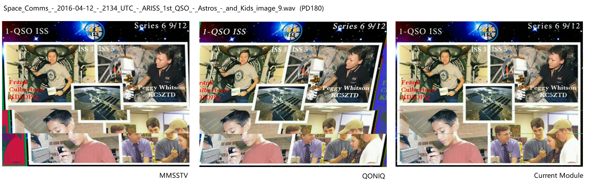

# SSTV Decoder for PD modes

A high-performance **Slow Scan Television (SSTV)** decoder written in **C++23** with Python bindings via `pybind11`.

This project focuses on decoding the **PD modes** (e.g., PD120, PD180, PD240).





## Features

* **Decoding**:
  * VIS (Vertical Interval Signaling) decoder with AFC.
  * PD Mode Demodulator (handling SYNC, PORCH, Y1, RY, BY, Y2 sequences).
* **Interface**: Python API compatible with `numpy` arrays for audio input.

## Requirements

* **C++ Compiler**: C++23.
* **Python**: >= 3.8.
* **Build Tools**: CMake >= 3.20, scikit-build-core, pybind11.

## Installation

To build and install this package from source, run the following command in the project root directory:

```bash
pip install .
```

## Usage

Below is a simple example of how to use the Python module to decode an audio stream.

```python
import numpy as np
from scipy.io import wavfile
import sstv_decoder
from PIL import Image  # Ensure pillow is installed: pip install pillow

class SSTVTestRunner:
    def __init__(self, sample_rate):
        self.decoder = sstv_decoder.Decoder(sample_rate)
        self.image_buffer = None
        self.current_mode = None
        self.lines_decoded = 0

        # Set callbacks
        self.decoder.set_on_mode_detected_callback(self.on_mode_detected)
        self.decoder.set_on_line_decoded_callback(self.on_line_decoded)
        self.decoder.set_on_image_complete_callback(self.on_image_complete)

    def on_mode_detected(self, mode):
        self.current_mode = mode
        print(f" [✓] SSTV Mode Detected: {mode.name} ({mode.width}x{mode.height})")
        # Initialize image buffer (height, width, RGB)
        self.image_buffer = np.zeros((mode.height, mode.width, 3), dtype=np.uint8)

    def on_line_decoded(self, line_idx, pixels):
        self.lines_decoded += 1
        if self.image_buffer is not None and 0 <= line_idx < self.image_buffer.shape[0]:
            # Convert list of Pixel objects to numpy array row
            # Assumes Pixel objects have r, g, b attributes
            row_data = np.array([[p.r, p.g, p.b] for p in pixels], dtype=np.uint8)
            # Pixel count for PD120 should match mode.width
            self.image_buffer[line_idx, :len(pixels)] = row_data
            
            if line_idx % 20 == 0:
                print(f"Decoding: Line {line_idx}...")

    def on_image_complete(self, width, height):
        print(f" [★] Image Reception Complete! Dimensions: {width}x{height}, Total Lines Decoded: {self.lines_decoded}")
        if self.image_buffer is not None:
            img = Image.fromarray(self.image_buffer)
            img.save("decoded_sstv_output.png")
            print(" [!] Result saved to decoded_sstv_output.png")

# 1. Load audio data
filename = './pd120_signal_script.wav'
sample_rate, audio_data = wavfile.read(filename)

# Normalize audio data to float32 range [-1.0, 1.0]
if audio_data.dtype == np.int16:
    audio_data = audio_data.astype(np.float32) / 32768.0
elif audio_data.dtype == np.int32:
    audio_data = audio_data.astype(np.float32) / 2147483648.0
elif audio_data.dtype in [np.float32, np.float64]:
    max_val = np.max(np.abs(audio_data))
    if max_val > 0:
        audio_data = audio_data.astype(np.float32) / max_val
else:
    raise ValueError(f"Unsupported data type: {audio_data.dtype}")

# Convert to mono if necessary
if audio_data.ndim > 1:
    audio_data = audio_data[:, 0]
    
# Add padding to ensure the end of the signal is processed
audio_data = np.pad(audio_data, (0, 2048), mode='constant', constant_values=0)

print(f"Audio loaded successfully: {len(audio_data)} samples, Sample rate: {sample_rate} Hz")

# 2. Initialize decoder runner
runner = SSTVTestRunner(float(sample_rate))

# 3. Simulate streaming input (chunking the data)
# Set chunk size, e.g., 1024 samples or 100ms of data
chunk_size = int(sample_rate * 0.02)  # 20ms chunks
print(f"Starting stream decoding (Chunk size: {chunk_size})...")

for i in range(0, len(audio_data), chunk_size):
    chunk = audio_data[i : i + chunk_size]
    # Call the C++ binding process method
    runner.decoder.process(chunk)

print("Processing finished.")
```

## Project Structure

* `include/`: C++ header files (DSP algorithms, decoder logic).
* `src/`: C++ implementation files.
* `bindings/`: Python bindings (`pybind11` wrapper).
* `python/`: Python package wrapper (`sstv_decoder/__init__.py`).
* `pyproject.toml`: Build configuration.

## License

LGPL License
